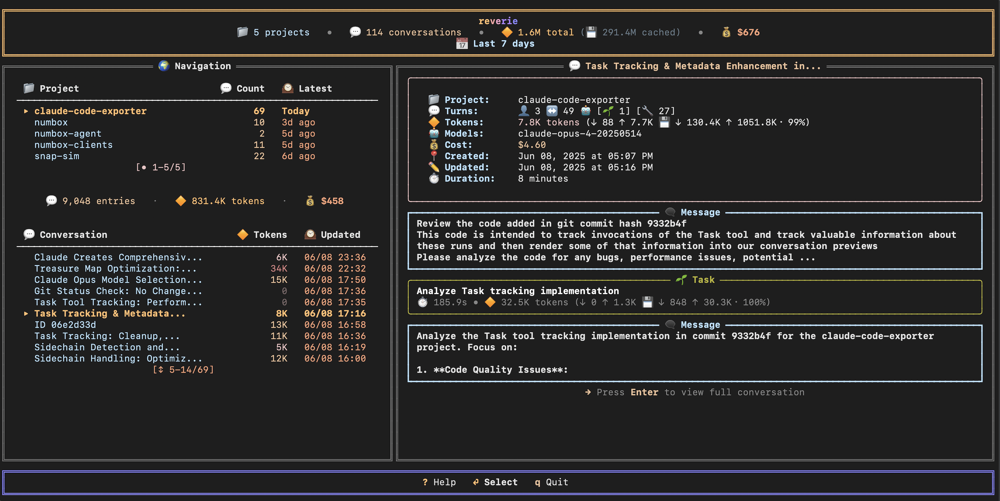

# 🔶 reverie

**Explore your Claude Code conversations**

reverie is a terminal UI for browsing, analyzing, and understanding your Claude Code conversation history. Navigate through projects, view token usage, track costs, and rediscover insights from past coding sessions.



## ✨ Features

- **📊 Conversation Explorer** - Browse all your Claude Code conversations organized by project
- **💰 Cost & Token Analytics** - Track token usage and costs across conversations and timeframes
- **🔍 Deep Dive Mode** - View full message history to understand how Claude Code works (🚧)
- **⚡ Live Monitoring** - Watch conversations unfold in real-time while Claude Code is running (🚧)

## 🚀 Installation

### From Source

```bash
git clone https://github.com/jberg/reverie.git
cd reverie

task install
task run
```

## 🎮 Keyboard Controls

- **Navigate projects**: `←`/`→` or `h`/`l`
- **Navigate conversations**: `↑`/`↓` or `j`/`k`
- **Change timeframe**: `t`
- **Reload conversations**: `r`
- **Export conversation**: `Enter` (🚧)
- **Quit**: `q`

## 💡 Why reverie?

Get delightfully distracted by your archives

- **Preserve knowledge** - Export conversations for future reference
- **Decode Claude's approach** - Study how Claude approaches different problems
- **Track progress** - Monitor ongoing conversations without interrupting them
- **Understand costs** - See exactly how many tokens each conversation uses

## Disclaimer

🔮 Token/Cost Disclaimer - We counted the tokens and cost. We're not sure we counted them right. Here they are anyway.
